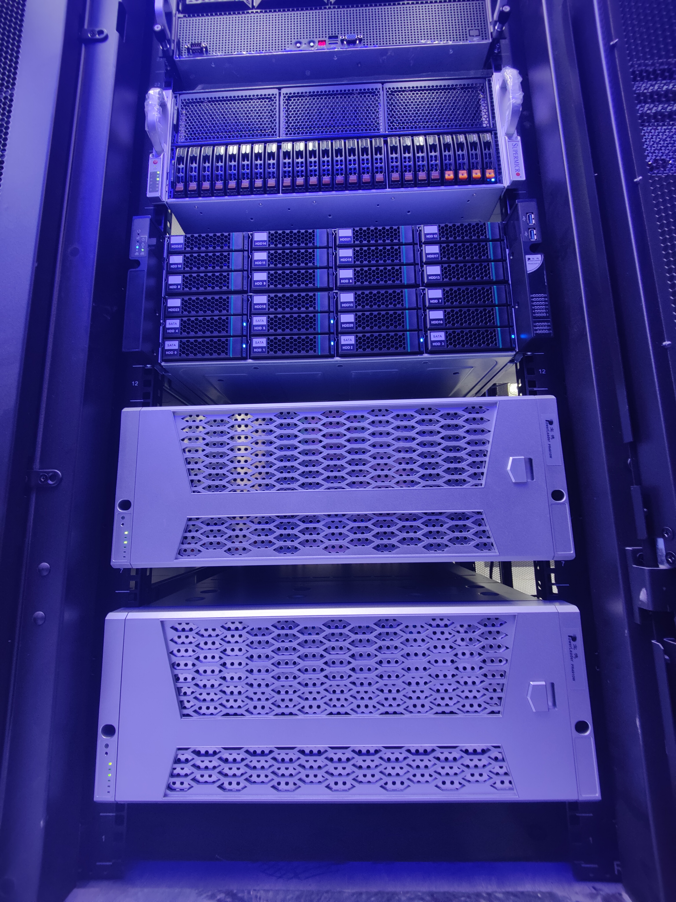
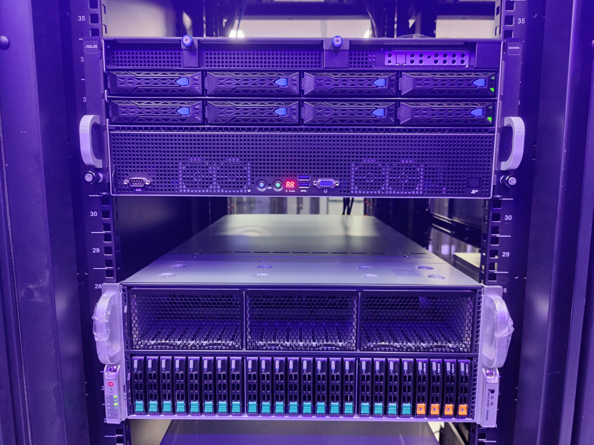

# Welcome to the LINs & Auto Lab cluster

This is a manual for cluster users.

## Quick Guide

- [Getting Started](./docs/Getting_started.md)

- [Determined-AI User Guide](./docs/Determined_AI_User_Guide.md)

- [Custom Containerized Environment](./docs/Custom_Containerized_Environment.md)

- [Problems May Encounter Using Clusters And Possible Solutions](./docs/Problems_And_Solutions.md)

## Introduction

Currently, we are hosting these services in the campus network (available after [configuring the `hosts`](./docs/Getting_started.md#hosts-modification)):

- [Web entry point](https://lins.lab)

- [Determined AI - Distributed Deep Learning and Hyperparameter Tuning Platform](https://gpu.lins.lab/)

- [Harbor - Container registry for GPU cluster](https://harbor.lins.lab/)

- [Grafana - Statistics and visualization](https://grafana.lins.lab/)

Our cluster is located in the core server room, E6-106.

We have been designated with an IP address range: `10.0.2.160-192/27`.

System Topology:

```text
┌───────────────────────────────────┐ ┌──────────────────────────────────┐
│             Login Node            │ │        NGINX Reverse Proxy       │
└─────────────┬─────────────────────┘ └────────┬────────┬────────────────┘
              │                                │        │
            Access      ┌────────Access────────┘      Access
              │         │                               │
┌─────────────▼─────────▼───────────┐ ┌─────────────────▼─────────────────┐
│     Determined AI GPU Cluster     │ │      Supplementary Services       │
├───────────────────────────────────┤ ├───────────────────────────────────┤
│                                   │ │                                   │
│ ┌──────┐ ┌────┐ ┌────┐ ┌────┐     │ │  ┌──────┐ ┌───────┐ ┌───────┐     │
│ │Master│ │GPU │ │GPU │ │GPU │     │ │  │      │ │       │ │       │     │
│ │      │ │    │ │    │ │    │ ... │ │  │Harbor│ │Grafana│ │ Other │ ... │
│ │ Node │ │Node│ │Node│ │Node│     │ │  │      │ │       │ │       │     │
│ └──────┘ └────┘ └────┘ └────┘     │ │  └──────┘ └───────┘ └───────┘     │
│                                   │ │                                   │
└───────────────────┬───────────────┘ └──────────┬────────────────────────┘
                    │                            │
                  Access                       Access
                    │                            │
┌───────────────────▼────────────────────────────▼────────────────────────┐
│                              TrueNAS - NFS                              │
├─────────────────────────────────────────────────────────────────────────┤
│                                                                         │
│                              Storage Server                             │
│                                                                         │
└─────────────────────────────────────────────────────────────────────────┘
```

### Hardware Information

<details>
<summary> Click to show photo </summary>


</details>

**Hardware Details**

LINs lab GPU Node 1, 2:

|  Name  |  Spec  |
| :----: | :----  |
|  Model | Powerleader PR4910W (Supermicro SYS-420GP-TNR)|
|  CPU   | Intel Xeon Platinum 8352Y*2 (64C/128T, 2.2-3.4GHz)|
|  RAM   | Samsung M393A4K40DB3-CWE DDR4 ECC REG 3200MHz 512G (32G * 16)|
|  GPU   | MSI (0x1462) RTX 3090 Turbo * 8|
|  SSD   | Samsung PM883 (MZ7LH960) 960GB 2.5" SATA drive * 2|
|  NIC   | Intel I350-T2 1GbE Dual Port|
|  NIC   | Intel X520-SR2 (82599ES) 10GbE Dual Port|
|  NIC   | Mellanox ConnectX-6 VPI HDR100 QSFP56 MCX653105A-ECAT 100Gb ETH/IB Single Port|
|  RAID  | LSI MegaRAID SAS 9361-8i|

LINs lab GPU Node 3:

|  Name  |  Spec  |
| :----: | :----  |
|  Model | ASUS ESC8000A-E11|
|  CPU   | AMD EPYC 7543 * 2 (64C/128T, 2.8-3.7GHz)|
|  RAM   | Samsung M393A4K40EB3-CWE DDR4 512G (32G*16) 3200MT/s ECC REG|
|  GPU   | MANLI (NVIDIA/0x10DE) RTX 4090 * 8 |
|  SSD   | Intel S4610 (SSDSC2KG96) 960G * 2 (RAID 1) |
|  NIC   | Intel X540-AT2 10GbE Dual Port|
|  NIC   | Intel X520-SR2 (82599ES) 10GbE Dual Port |
|  RAID  | LSI SAS3008 PCI-Express Fusion-MPT SAS-3 |

LINs lab GPU Node 4:

|  Name  |  Spec  |
| :----: | :----  |
|  Model | Powerleader PR4908R (Supermicro 4124GS-TNR)|
|  CPU   | AMD EPYC 7543 * 2 (64C/128T, 2.8-3.7GHz)|
|  RAM   | Samsung M393A4K40DB3-CWE DDR4 512G (32G*16) 3200MT/s ECC REG |
|  GPU   | Colorful (0x7377) RTX 4090 * 8 |
|  SSD   | Samsung PM883 (MZ7LH960HAJR-00005) 960GB 2.5" SATA drive * 2|
|  NIC   | Intel X520-SR2 (82599ES) 10GbE Dual Port |
|  NIC   | Intel i350-T2 1GbE Dual Port |
|  RAID  | LSI MegaRAID SAS 9361-8i|

LINs lab GPU Node 5:

|  Name  |  Spec  |
| :----: | :----  |
|  Model | AMAX ServMax G428-H3 (ASUS ESC8000A-E11)|
|  CPU   | AMD EPYC 7543 * 2 (64C/128T, 2.8-3.7GHz)|
|  RAM   | Samsung M393A4K40DB3-CWE DDR4 512G (32G*16) 3200MT/s ECC REG |
|  GPU   | Colorful (0x7377) RTX 4090 * 8 |
|  SSD   | Intel D3-S4510 960GB 2.5" SATA drive * 2|
|  NIC   | Intel X520-SR2 (82599ES) 10GbE Dual Port |
|  NIC   | Intel i350-T2 1GbE Dual Port |
|  RAID  | LSI MegaRAID SAS 9361-8i|

LINs lab GPU Node 6, Auto lab GPU Node 1:

|  Name  |  Spec  |
| :----: | :----  |
|  Model | ASUS ESC8000A-E12|
|  CPU   | AMD EPYC 9554 * 2 (128C/256T, 3.1-3.75GHz)|
|  RAM   | Samsung M321R4GA3BB6-CQKDS DDR5 768G (32*24) 4800MT/s ECC REG|
|  GPU   | Gigabyte (0x1458) RTX 4090 * 8 |
|  SSD   | Micron 5300 1.92TB 2.5" SATA drive * 2|
|  NIC   | Intel X520-SR2 (82599ES) 10GbE Dual Port |
|  NIC   | Intel I350-T2 1GbE Dual Port |

Auto lab GPU Node 2:

|  Name  |  Spec  |
| :----: | :----  |
|  Model | Powerleader PR4908W |
|  CPU   | Intel Xeon Gold 6330 * 2 (56C/112T, 2.0-3.1GHz) |
|  RAM   | Samsung M393A8G40BB4-CWE DDR4 768G (64*12) 3200MT/s @ 2933MT/s ECC REG |
|  GPU   | NVIDIA (0x10de) L40 48G * 8 |
|  SSD   | Samsung PM893 960G 2.5" SATA drive * 2 (RAID1) |
|  NIC   | Intel X520-SR2 (82599ES) 10GbE Dual Port |
|  NIC   | Intel I350-T2 1GbE Dual Port * 2 |
|  RAID  | Broadcom / LSI MegaRAID SAS-3 3108|

Storage & Management Server:

|  Name  |  Spec  |
| :----: | :----  |
|  Model | Powerleader PR4036P3|
|  CPU   | Intel Xeon Silver 4210R*2  (20C/40T, 2.4-3.2GHz)|
|  RAM   | Samsung M393A8G40AB2-CWE DDR4 ECC REG 3200MHz 256G (64G * 4)|
|  SSD   | Samsung PM883 (MZ7LH960) 960GB 2.5" SATA drive * 2|
|  SSD   | Samsung PM983 (MZQLB7T6HMLA-00003) 7.68TB 2.5" NVMe U.2 drive|
|  SSD   | Intel P5510 2.5" U.2 NVMe 7.68T *4 |
|  HDD   | Seagate Exos X18 (ST18000NM000J-2T) 18TB * 6|
|  NIC   | Intel X520-SR2 (82599ES) 10GbE Dual Port|
|  NIC   | Intel i350-AM2 1GbE Dual Port |
|  RAID  | LSI MegaRAID SAS 9361-8i|
