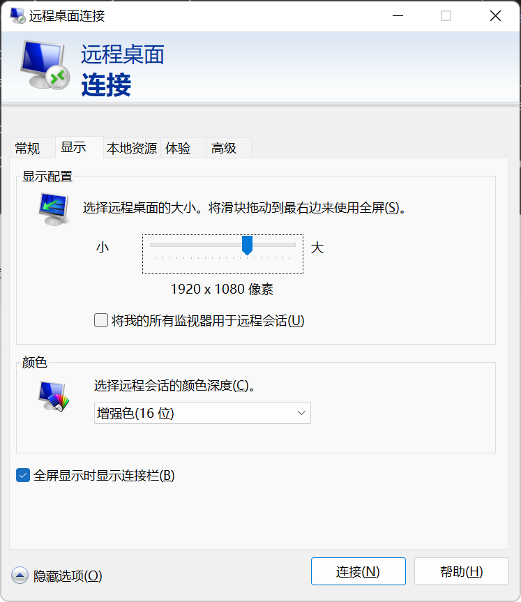
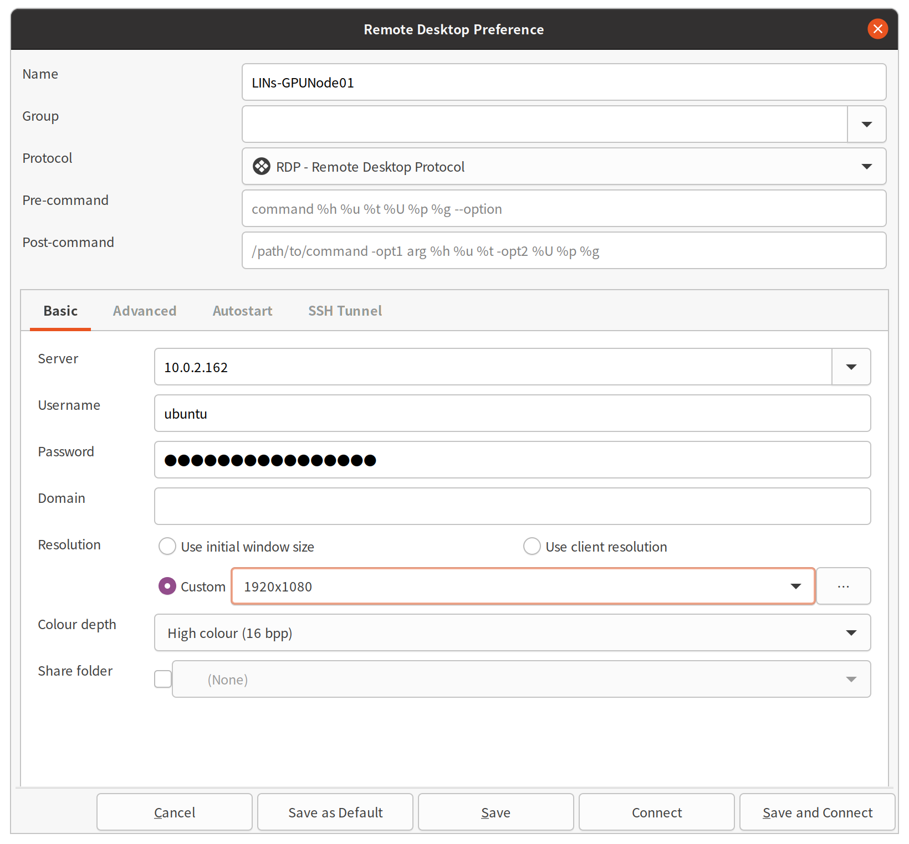
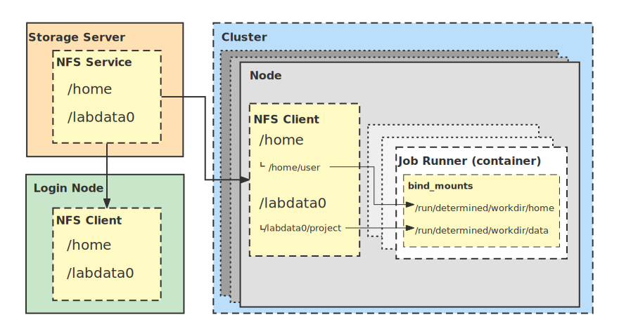
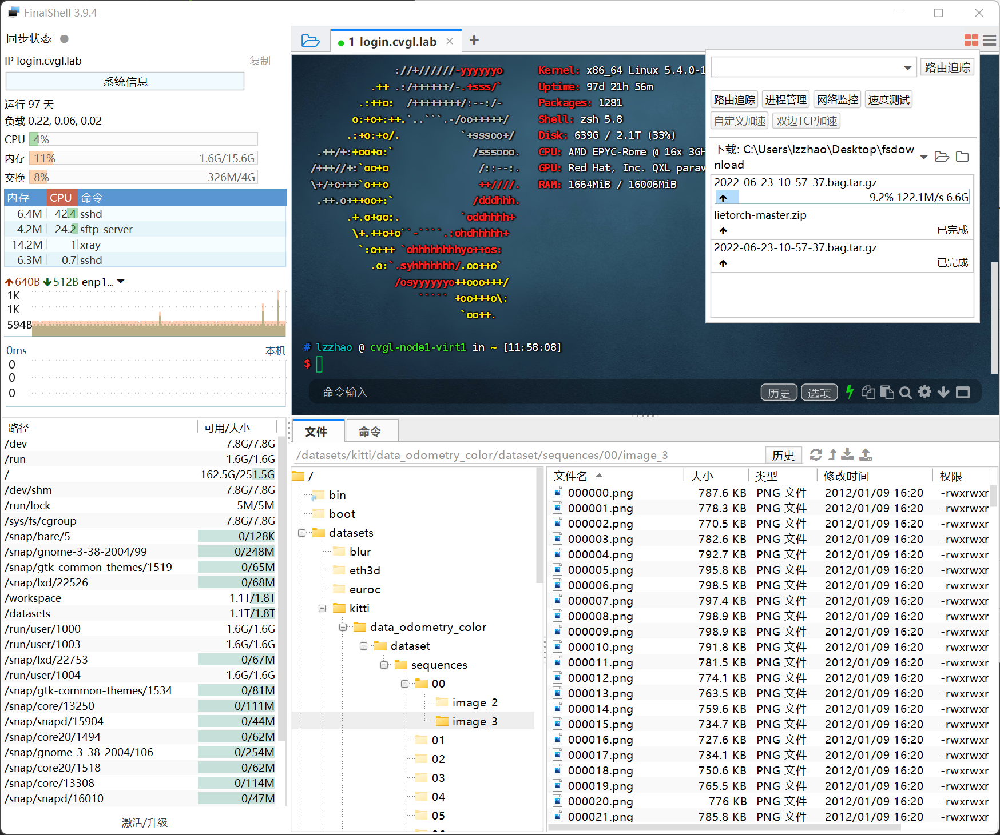
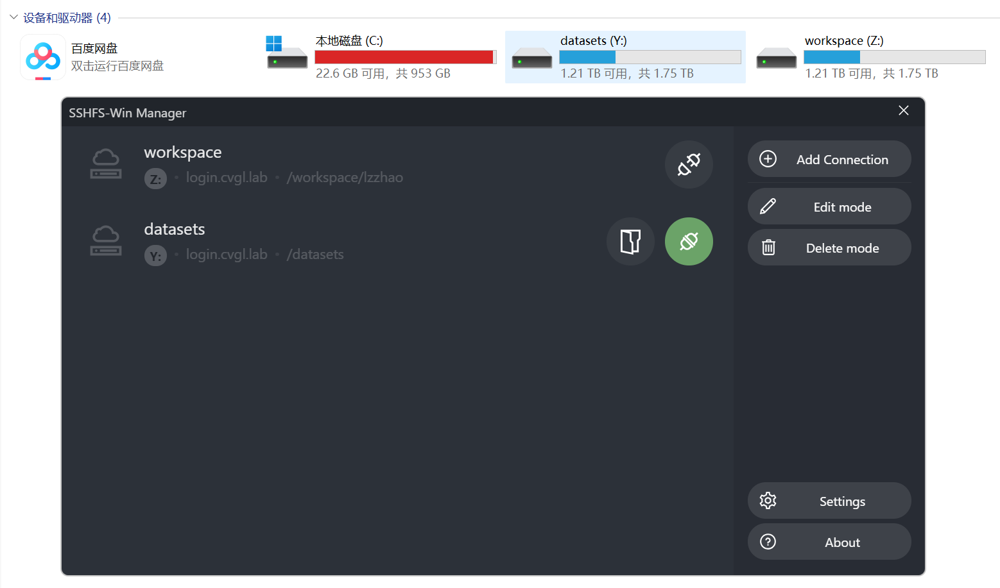
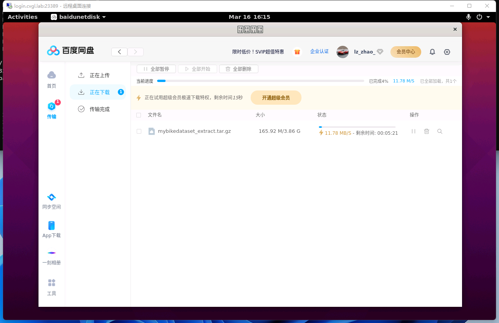

<h1 align="center">Getting started with the cluster</h1>

- [Requesting accounts](#requesting-accounts)
- [Accessing the cluster](#accessing-the-cluster)
  - [Security](#security)
  - [Setting up the hosts file](#setting-up-the-hosts-file)
    - [For Windows](#for-windows)
    - [For Linux, \*nix including macOS](#for-linux-nix-including-macos)
    - [Hosts Modification](#hosts-modification)
  - [Install the root CA certificate (Optional)](#install-the-root-ca-certificate-optional)
  - [SSH](#ssh)
    - [SSH in Linux, \*nix including macOS](#ssh-in-linux-nix-including-macos)
    - [SSH in Windows](#ssh-in-windows)
    - [SSH keys](#ssh-keys)
    - [SSH keys on Linux](#ssh-keys-on-linux)
    - [SSH keys on Windows](#ssh-keys-on-windows)
    - [Safety rules](#safety-rules)
    - [How to use keys with non-default names](#how-to-use-keys-with-non-default-names)
  - [X11 forwarding and remote desktop](#x11-forwarding-and-remote-desktop)
    - [X11 forwarding](#x11-forwarding)
    - [Remote desktop via RDP](#remote-desktop-via-rdp)
- [Data management](#data-management)
  - [Introduction](#introduction)
  - [Uploading and downloading data](#uploading-and-downloading-data)
    - [Uploading](#uploading)
    - [Downloading](#downloading)

# Requesting accounts

Accounts that need to be created by the administrator (Peng SUN, sp12138sp@gmail.com) include:

- A Linux account on the login node (`login.lins.lab`)
- An account for the batch system (Determined AI, [gpu.lins.lab](https://gpu.lins.lab)).

Note:

- You can only access the links above after setting up the `hosts` file.

# Accessing the cluster

A Web entry point can be found [here](https://lins.lab).

## Security

Accessing the cluster is currently only possible via secure protocols (ssh, scp, rsync). The cluster is only accessible from inside the campus's local area network. If you would like to connect from a computer, which is not inside the campus network, then you would need to establish a [VPN](https://vpn.westlake.edu.cn/) connection first.

## Setting up the hosts file

Since our cluster is only accessible inside the campus's LAN, and we do not have the administration of the DNS server, setting up the `hosts` file is the best way to translate human-friendly hostnames into IP addresses.

The way to modify the `hosts` file is as follows:

### For Windows

- Press `Win-Key + R`. A small window will pop up.

- Type in the following command and press `Ctrl+Shift+Enter`, to make notepad run as administrator and edit the `hosts` file.

```bat
notepad C:\Windows\System32\drivers\etc\hosts
```

### For Linux, *nix including macOS

- Edit `/etc/hosts` with root privilege in your favorite way. For example:

```bash
sudo vim /etc/hosts
```

### Hosts Modification

Append these lines to the end of the `hosts` file:

```text
10.0.2.166 login.lins.lab
10.0.2.168 lins.lab
10.0.2.168 gpu.lins.lab
10.0.2.168 harbor.lins.lab
10.0.2.168 grafana.lins.lab
```

## Install the root CA certificate (Optional)

Since we are using a self-signed certificate, after modifying the host, when we use a web browser to access the service, a security warning appears saying the certificate is not recognized. We can suppress this warning by making the system trust the certificate.

The certificate can be downloaded at: [https://lins.lab/lins-lab.crt](https://lins.lab/lins-lab.crt)

- For Windows, right-click the CA certificate file and select 'Install Certificate'. Follow the prompts to add the certificate to the **Trusted Root Certification Authorities**. If you are using Git for Windows, you will need to configure Git to use Windows native crypto backend: `git config --global http.sslbackend schannel`

- For Linux (tested Ubuntu), first, you need the `ca-certificates` package installed, then copy the `.crt` file into the folder `/usr/local/share/ca-certificates`, and update certificates system-wide with the command `sudo update-ca-certificates`. This works for most applications, but browsers like google-chrome and chromium on Linux have their own certificate storage. You need to go to `chrome://settings/certificates`, select "Authorities", and import the `.crt` file. To use our Harbor registry `harbor.lins.lab`, you need to create the folder `/etc/docker/certs.d/harbor.lins.lab/` and copy the certificate into it.

## SSH

You can connect to the cluster via the SSH protocol. For this purpose, it is required that you have an SSH client installed. The information required to connect to the cluster is the hostname (which resolves to an IP address) of the cluster and your account credentials (username, password).

Since we have set up the `hosts` in the [previous section](#hosts-modification), we can use the human-readable hostname to make our connection.

| Hostname | IP Address | Port |
| :-- | :-- | :-- |
|login.lins.lab|10.0.2.166|22332|
|(temporary)|10.0.2.162|33322|

### SSH in Linux, *nix including macOS

Open a terminal and use the standard ssh command

```bash
ssh -p 22332 username@login.lins.lab
```

VPN users can use the temporary access point on `10.0.2.162`:

```bash
ssh -p 33322 username@10.0.2.162
```

where **username** is your username and the **hostname** can be found in the table shown above. The parameter `-p 22332` is used to declare the SSH port used on the server. For security, we modified the default port. If for instance, user **peter** would like to access the cluster, then the command would be

```text
peter@laptop:~$ ssh -p 22332 peter@login.lins.lab
peter@login.lins.lab's password:
Welcome to Ubuntu 20.04.4 LTS (GNU/Linux 5.4.0-104-generic x86_64)

* Documentation:  https://help.ubuntu.com
* Management:     https://landscape.canonical.com
* Support:        https://ubuntu.com/advantage

System information as of Tue 15 Mar 2022 11:51:03 AM UTC

System load:  0.0                 Users logged in:          1
Usage of /:   28.0% of 125.49GB   IPv4 address for docker0: 172.17.0.1
Memory usage: 6%                  IPv4 address for enp1s0:  192.168.122.2
Swap usage:   0%                  IPv4 address for enp6s0:  10.0.2.166
Processes:    278

0 updates can be applied immediately.

Last login: Tue Mar 15 11:29:19 2022 from 172.16.29.72
```

Note that when it prompts to enter the password:

```text
peter@login.lins.lab's password:
```

there will not be any visual feedback (i.e. asterisks) in order not to show the length of your password.

### SSH in Windows

Since Windows 10, an ssh client is also provided in the operating system, but it is more common to use third-party software to establish ssh connections. Widely used ssh clients are for instance MobaXterm, XShell, FinalShell, Terminus, PuTTY and Cygwin.

For using MobaXterm, you can either start a local terminal and use the same SSH command as for Linux and Mac OS X, or you can click on the session button, choose SSH and then enter the hostname and username. After clicking on OK, you will be asked to enter your password.

How to use MobaXterm: [How to access the cluster with MobaXterm - ETHZ](https://scicomp.ethz.ch/wiki/How_to_access_the_cluster_with_MobaXterm) / [Download and setup MobaXterm - CECI](https://support.ceci-hpc.be/doc/_contents/QuickStart/ConnectingToTheClusters/MobaXTerm.html)

How to use PuTTY: [How to access the cluster with PuTTY - ETHZ](https://scicomp.ethz.ch/wiki/How_to_access_the_cluster_with_PuTTY)

> An alternative option: use WSL/WSL2 [[CECI Doc]](https://support.ceci-hpc.be/doc/_contents/QuickStart/ConnectingToTheClusters/WSL.html)

### SSH keys

It is recommended to create SSH keys: Imagine when the network connection is unstable, typing the passwords, again and again, is frustrating. Using SSH Certificates, you will never need to type in passwords during logging in. Powered by cryptography, it prevents man-in-the-middle attacks, etc.

The [links](#ssh-in-windows) above demonstrate methods using GUI. You can also create the keys with CLI:

### SSH keys on Linux

For security reasons, we recommend that you use a different key pair for every computer you want to connect to:

```bash
ssh-keygen -t ed25519 -f $HOME/.ssh/id_lins
```

It is recommended to set a passphrase for the private key.

Once this is done, copy the public key to the cluster:

```bash
ssh-copy-id -i $HOME/.ssh/id_lins.pub -p 22332 username@login.lins.lab
```

VPN users can use the temporary access point on `10.0.2.162`:

```bash
ssh-copy-id -i $HOME/.ssh/id_lins.pub -p 33322 username@10.0.2.162
```

Finally, you can add the private key to the ssh-agent temporarily so that you don't need to enter the passphrase every time (You still need to do this every time after reboot).

```bash
ssh-add ~/.ssh/id_lins
```

### SSH keys on Windows

For Windows, third-party software ([PuTTYgen](https://www.puttygen.com/)](https://www.puttygen.com/), [MobaXterm](https://mobaxterm.mobatek.net/)) is commonly used to create SSH keys (demonstrated in the [links above](#ssh-in-windows)), however, since Windows 10, we can also follow similar steps in PowerShell:

- Step 1. On your PC, go to the folder:

```bash
mkdir ~/.ssh && cd ~/.ssh
```

- Step 2. Create a public/private key pair:

```bash
ssh-keygen -t ed25519 -f id_lins
```

It's recommended to set a passphrase for the private key for advanced safety.

- Step 3. The program `ssh-copy-id` is not available so we manually copy the public key:

```bash
notepad ~/.ssh/id_lins.pub
```

(Copy)

- Step 4. On the remote Server, create and edit the file, and paste the public key into it:

```bash
mkdir ~/.ssh && vim ~/.ssh/authorized_keys
```

(Paste to above and Save)

- Step 5. Start the ssh-agent; Apply the private key so that you don't need to enter the passphrase every time (You need to do this every time after the system starts up)

```bash
ssh-agent

ssh-add ~/.ssh/id_lins
```

### Safety rules

- Always use a (strong) passphrase to protect your SSH key. Do not leave it empty!

- Never share your private key with somebody else, or copy it to another computer. It must only be stored on your personal computer

- Use a different key pair for each computer you want to connect to

- Do not reuse the key pairs for other systems

- Do not keep open SSH connections in detached `screen` sessions

- Disable the ForwardAgent option in your SSH configuration and do not use ssh -A (or use ssh -a to disable agent forwarding)

### How to use keys with non-default names

If you use different key pairs for different computers (as recommended above), you need to specify the right key when you connect, for instance:

```bash
ssh -p 22332 -i $HOME/.ssh/id_lins username@login.lins.lab
```

VPN users can use the temporary access point on `10.0.2.162`:

```bash
ssh -p 33322 -i $HOME/.ssh/id_lins username@10.0.2.162
```

To make your life easier, you can configure your ssh client to use these options automatically by adding the following lines in your $HOME/.ssh/config file:

```text
Host cluster
    HostName        login.lins.lab
    Port            22332
    User            username
    IdentityFile    ~/.ssh/id_lins
```

VPN users can use the temporary access point on `10.0.2.162`:

```text
Host cluster
    HostName        10.0.2.162
    Port            33322
    User            username
    IdentityFile    ~/.ssh/id_lins
```

For Windows Users, you need to use the backslash in `IdentityFile`:

IdentityFile    ~\\.ssh\\id_lins

Then your ssh command simplifies as follows:

```bash
ssh cluster
```

## X11 forwarding and remote desktop

### X11 forwarding

Sometimes we need to run GUI applications on the login node. To directly run GUI applications in ssh terminals, you must open an SSH tunnel and redirect all X11 communication through that tunnel.

Xorg (X11) is normally installed by default as part of most Linux distributions. For Windows, tools such as [vcxsrv](https://sourceforge.net/projects/vcxsrv/) or [x410](https://x410.dev/) can be used. For macOS, since X11 is no longer included, you must install [XQuartz](https://www.xquartz.org/). You may want to check out the [Troubleshooting section](https://scicomp.ethz.ch/wiki/Accessing_the_clusters#Troubleshooting) by ETHZ IT-Services.

### Remote desktop via RDP

RDP (Remote Desktop Protocol) provides a remote desktop interface that is more user-friendly. To connect using RDP, you need an RDP Client installed. On Windows, there is a built-in remote desktop software `mstsc.exe`, or you can download a newer `Microsoft Remote Desktop` from the Microsoft Store.
On Linux, it's recommended to install `Remmina` and `remmina-plugin-rdp`.

Using the RDP Clients is simple. Following the prompts, type in the server address, user name and password. Then, set the screen resolution and color depth you want.

For security, RDP is only allowed from SSH tunnels, and the default RDP port is also changed from 3389 to 23389. One can create the SSH tunnel and forward RDP connections to localhost:23389 by:

```bash
ssh -p 22332 -NL 23389:localhost:23389 username@login.lins.lab
```

VPN users may use the temporary access point on `10.0.2.162` instead of `login.cvgl.lab`:

```bash
ssh -p 33322 -NL 23389:localhost:23389 username@10.0.2.162
```

Note: If you have completed [this step](#how-to-use-keys-with-non-default-names), you can shorten the command:

```bash
ssh -NL 23389:localhost:23389 cluster
```

Then connect to `localhost:23389` using `mstsc.exe` or Remote Desktop App from [Microsoft Store](https://apps.microsoft.com/store/detail/microsoft-remote-desktop/9WZDNCRFJ3PS)

<details>
<summary> Click to show image</summary>




</details>

# Data management

## Introduction



We are currently using NFS to share filesystems between cluster nodes. The storage space of the login node is small (about 100GB), so it is recommended to store code and data in NFS shared folders: `/dataset` for datasets and `/workspace` for workspaces. The two NFS folders are allocated on the storage server, which currently offers a capacity of 143TB, with data redundancy and snapshot capability powered by TrueNAS ZFS.

We can check the file systems with the command `df -H`:

```text
    peter@login.lins.lab: ~ $ df -H

    Filesystem                                  Size  Used Avail Use% Mounted on
    /dev/nvme0n1p2                              138G   25G  113G  19% /
    nas.lins.lab:/mnt/Peter/Datasets            143T  4.2T  139T   3% /datasets
    nas.lins.lab:/mnt/Peter/Workspace/peter     8.8T  136G  8.7T   2% /workspace/peter
```

You need to ask the system admin to create your workspace folder `/workspace/<username>`.

By default, other users do not have either read or write [permissions](https://scicomp.ethz.ch/wiki/Linux_permissions) on your folder.

## Uploading and downloading data

### Uploading

When you transfer data from your personal computer to a storage server, it's called an upload.
We can use CLI tools like `scp`, `rsync`; or GUI tools like `mobaXterm`, `FinalShell`, `VSCode`, `xftp`, `SSHFS` for uploading files from a personal computer to the data storage.

Here is an example of using FinalShell:

<details>
<summary> Click to show image</summary>


</details>

Here is an example of using SSHFS-win:

<details>
<summary> Click to show image</summary>


</details>

### Downloading

When you get data from a service provider such as Baidu Netdisk, Google Drive, Microsoft Onedrive, Amazon S3, etc., it's called a download. For example, you can use the Baidu Netdisk client (already installed).
You can also download datasets directly from the source. It is recommended to use professional download software to download large datasets, such as aria2, motrix (aria2 with GUI), etc.

Here is an example of using Baidu Netdisk:

<details>
<summary> Click to show image</summary>


</details>
