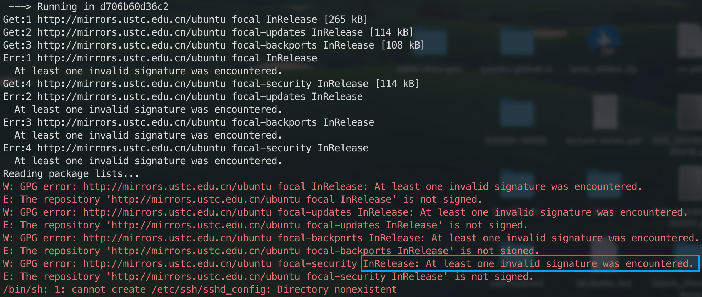

<h1 align="center">Problems May Enconuter Using Clusters And Possible Solutions</h1>


- [1. GPG Error When Building Docker Image](#1-gpg-error-when-building-docker-image)


## 1. GPG Error When Building Docker Image

When building a Docker image, you may encounter the following error:



This is because the docker cache consumes too much disk space. You can clean the cache by running the following commands:

```shell
docker system df # which can show disk usage and size of 'Build Cache'
docker image prune # add -f or --force to not prompt for confirmation
docker container prune # add -f or --force to not prompt for confirmation
```

Reference: [Repository is not signed in docker build](https://stackoverflow.com/questions/59139453/repository-is-not-signed-in-docker-build)